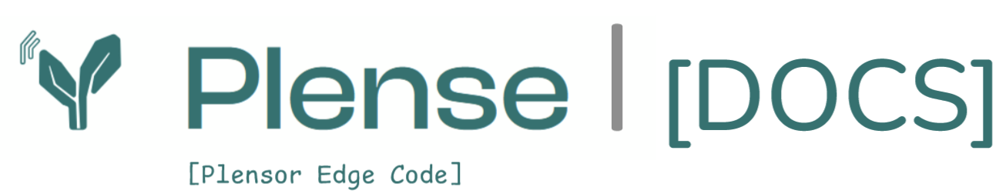

# plensetechdoc-sensoredgecode
Documentation and code for the distributed sensor system of 'plensors' from the company plense-technologies.. 

# _Plensor Sensor Platform_

Plensor is a modular ultrasonic sensing platform for environmental monitoring, object detection, and remote deployments. It includes hardware (custom Pi Hat + sensors), embedded control logic (GPIO and RS485), a configurable measurement engine, and a robust signal processing pipeline.

---

## 🚀 Features

- Multi-sensor orchestration via RS485
- Custom Pi Hat with GPIO control for power cycling
- Configurable signal bursts (SINE, BLOCK, TOF)
- High-fidelity audio capture (192 kHz FLAC)
- Streamlit-based metadata interface
- Full logging and watchdog support
- Extensible signal processing pipeline with NumPy/SciPy

---

## 📁 Repository Structure

```
/
├── code/ # All code modules
│ ├── measure-plensor/ # Measurement system and sensor mixins
│ ├── process-data/ # Signal processing scripts
│ ├── metadata/ # Streamlit GUI for config
│ ├── log-manager/ # Logger, watchdog, error handling
│ └── deployments/ # Metadata and examples
├── docs/ # Documentation site
│ ├── *.md # Pages like architecture.md, commands.md, etc.
│ └── assets/ # All supporting diagrams and screenshots
├── README.md # This file
```


---

## 📖 Documentation

Full documentation is in `/docs/`.

Start with: [docs/index.md](docs/index.md)

-> or go to code documentation: [code/README.md](code/README.md)

Includes:
- Architecture overview
- GPIO + relay wiring
- Command reference
- Measurement queue logic
- Data structure and processing flow
- Logging, errors, and deployments

---


## 🗃️ Original Documentation Files

Additional original reports, logs, and slides can be found in:

- [docs/documentation_logs/](docs/documentation_logs/)

---
## 🛠 Requirements

- Raspberry Pi 4 or Compute Module
- Plensor Pi Hat + connected sensor
- Python 3.9+
- Required packages (see `requirements.txt`)

---

## 🧪 Running the Measurement App

```bash
cd code/measure-plensor
python3 app.py
```

---

## 🔗 Links

- [Documentation Index](docs/index.md)
- [Images Table](docs/images-table.md)
- [Sensor Commands](docs/sensor_commands.md)

---

## 📜 License

See [LICENSE](LICENSE) for terms and conditions.
